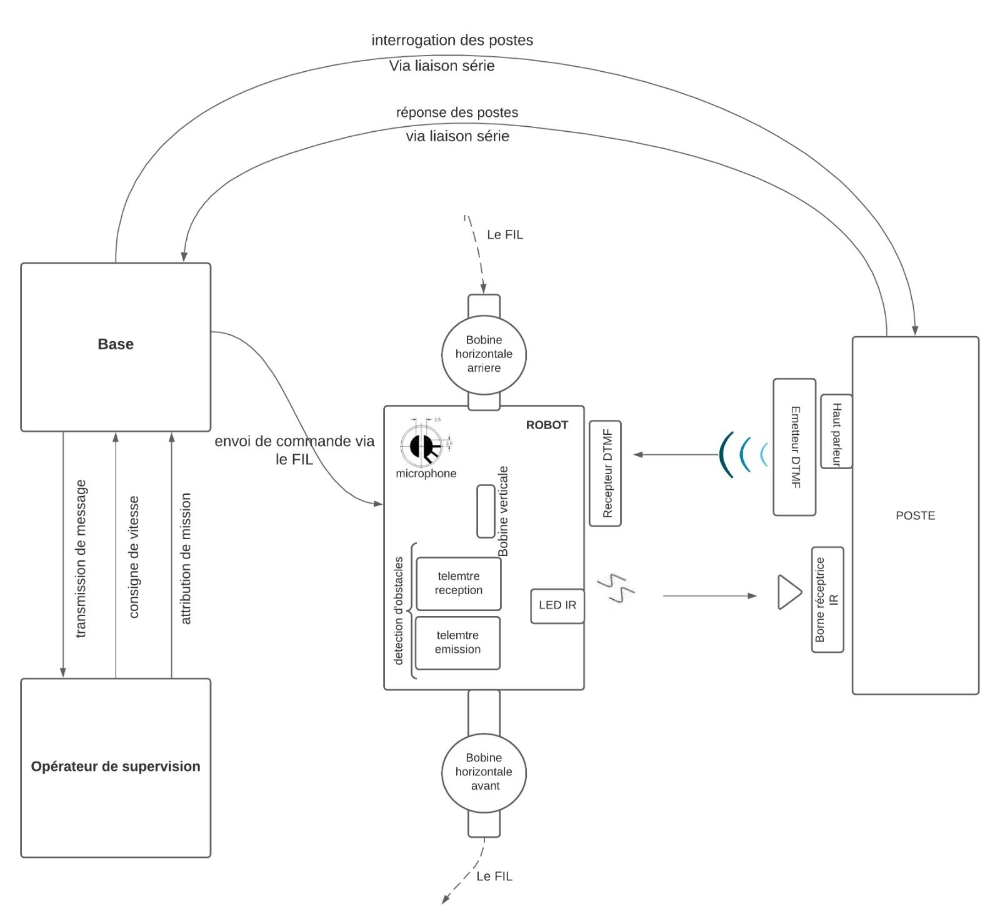

# Wire-guided-Robot
Design and construction of a wire guided delivery robot

A wire guired robot delivery system, that travels in a loop along a defined path with an electric wire. This project found its inspiration in the robots used at industrial warehouses. The robot receives delivery instructions through a control base system to deliver or pick up packages from different workstations.

This is the final undergraduate year projet, of the 2021 electronics and electrical engineering class.

I was the project learder of 5 teamates and my role was : 

* Design the circuits of various sensors and components.
* I was resposible for all programming the 3 microcontrollers [robots, workstation and command base]

1. **Transmit communication signals through the induction guidance electric wire to the robot** : 
    * Using a guidence wire to transmit a modulated electric current to encode messages with a Morse code inspired encription
    * The base system is capable of signaling the robots and assigning them missions (park on the right/left for loading/unloading - change of speed).

2. **DTMF codes emitted by the workstation**:
    * Each workstation emits a different DTMF code through a speaker, allowing the robot passing by to identify its number.
    * Using a Digital-to-Analog Converter (DAC) for generating the DTMF signals..

3. **Motorization of the wheels of the mobile robot** :
    * Implemented a emergency stop system.
    * Controled the PWM motors based on the position of the robot on the trajectory [Inductive sensors embedded on the mobile robot].
    
4. **Robot - Workstation Communication: INFRARED bases**
    * Emission d’une trame IR par le Microcontrôleur basé sur le robot (injectée dans une LED IR) représentant des codes sur 20 bits (numéro robot, vitesse..).
Robot - Workstation Communication: INFRARED

Emitting an INFRARED signals, injected into an IR LED, by the robot's microcontroller representing codes on 20 bits (robot number, speed, etc.)

#### Delivery System

